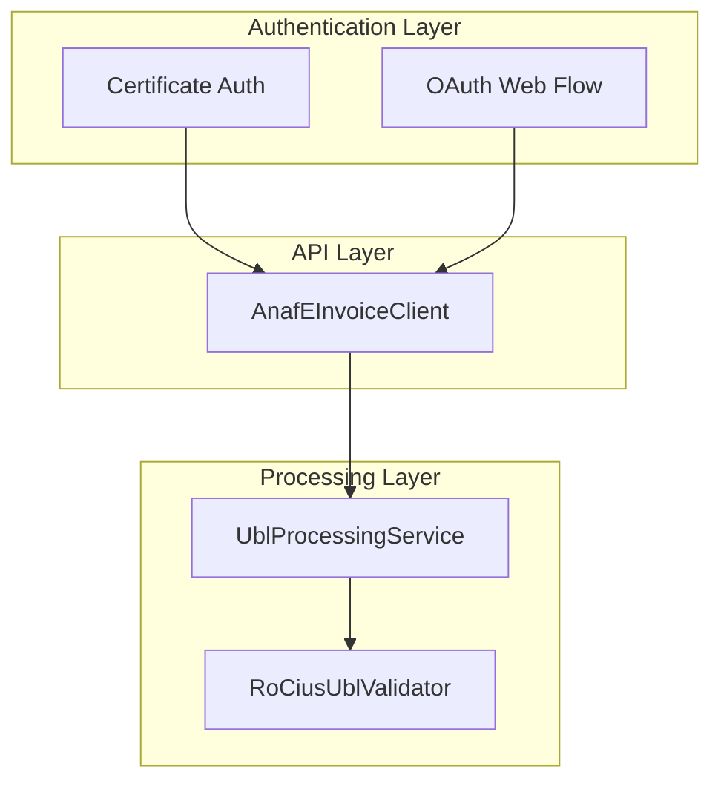

# RoEFactura - Romanian ANAF eInvoicing Integration

[](https://www.nuget.org/packages/RoEFactura)
[](https://dotnet.microsoft.com/download/dotnet/9.0)
[](LICENSE)

RoEFactura is a .NET library for integrating with the Romanian ANAF eFactura system. It supports certificate-based authentication for desktop/server scenarios and OAuth 2.0 redirect flow for web apps. It also provides local UBL 2.1 processing with RO_CIUS validation.

## Features

- Dual authentication: certificate-based and OAuth redirect flow
- ANAF API coverage: list, download, validate, upload e-invoices
- Local UBL 2.1 processing and RO_CIUS validation
- Invoice analysis extension methods
- Processing statistics and logging integration

## Requirements

- .NET 9.0 (net9.0)
- Romanian digital certificate installed in CurrentUser/Personal (for certificate-based flow)

## Installation

### NuGet Package Manager
```bash
Install-Package RoEFactura
```

### .NET CLI
```bash
dotnet add package RoEFactura
```

### PackageReference
```xml
<PackageReference Include="RoEFactura" Version="1.0.4" />
```

## Quick Start

### Certificate-based (desktop/server)

```csharp
using Microsoft.Extensions.DependencyInjection;
using RoEFactura;
using RoEFactura.Services.Api;
using RoEFactura.Services.Authentication;

var services = new ServiceCollection();
services.AddRoEFactura();

var provider = services.BuildServiceProvider();
var auth = provider.GetRequiredService<IAnafOAuthClient>();
var invoices = provider.GetRequiredService<IAnafEInvoiceClient>();

var token = await auth.GetAccessTokenAsync(
    clientId: "your_client_id",
    clientSecret: "your_client_secret",
    callbackUrl: "https://yourapp.com/callback");

var items = await invoices.ListEInvoicesAsync(
    token.AccessToken, days: 30, cui: "RO12345678");
```

### OAuth redirect flow (web apps)

```csharp
// Program.cs
builder.Services.AddRoEFacturaWithOAuth(builder.Configuration, "AnafOAuth");
```

```json
// appsettings.json
{
  "AnafOAuth": {
    "ClientId": "your_client_id",
    "ClientSecret": "your_client_secret",
    "RedirectUri": "https://yourapp.com/api/oauth/callback"
  }
}
```

```csharp
// Controller example
[HttpPost("oauth/initiate")]
public IActionResult Initiate()
{
    var state = GenerateState();
    var authUrl = _anafClient.GenerateAuthorizationUrl(_options, state);
    return Ok(new { authorizationUrl = authUrl, state });
}

[HttpGet("oauth/callback")]
public async Task<IActionResult> Callback(string code, string state)
{
    ValidateState(state);
    var token = await _anafClient.ExchangeAuthorizationCodeAsync(code, _options);
    await StoreTokenAsync(token);
    return Redirect("/dashboard?authorized=true");
}
```

## Configuration

You can configure OAuth options via configuration or direct options:

```csharp
services.AddRoEFacturaWithOAuth(new AnafOAuthOptions
{
    ClientId = "your_client_id",
    ClientSecret = "your_client_secret",
    RedirectUri = "https://yourapp.com/oauth/callback",
    AuthorizeUrl = "https://logincert.anaf.ro/anaf-oauth2/v1/authorize",
    TokenUrl = "https://logincert.anaf.ro/anaf-oauth2/v1/token",
    IncludeTokenContentType = true
});
```

## Basic Usage

### List invoices (non-paged)

```csharp
var items = await invoiceClient.ListEInvoicesAsync(token.AccessToken, 30, "RO12345678", filter: null);
```

### List invoices (paged)

```csharp
long start = DateTimeOffset.UtcNow.AddDays(-30).ToUnixTimeMilliseconds();
long end = DateTimeOffset.UtcNow.ToUnixTimeMilliseconds();

var page = await invoiceClient.ListPagedEInvoicesAsync(
    token.AccessToken, start, end, "RO12345678", filter: null, page: 1);
```

### Download and process invoice

```csharp
var result = await invoiceClient.ProcessDownloadedInvoiceAsync(token.AccessToken, "download_id");
if (result.IsSuccess)
{
    var invoice = result.Data;
    var totalDue = invoice.GetTotalAmountDue();
}
```

### Validate XML locally (RO_CIUS)

```csharp
var localResult = await invoiceClient.ValidateInvoiceXmlAsync(xmlContent);
if (!localResult.IsSuccess)
{
    foreach (var error in localResult.Errors)
    {
        Console.WriteLine($"{error.ErrorCode}: {error.ErrorMessage}");
    }
}
```

### Validate/Upload XML via ANAF API

```csharp
string validateResponse = await invoiceClient.ValidateXmlContentAsync(token.AccessToken, xmlContent);
string uploadResponse = await invoiceClient.UploadXmlContentAsync(token.AccessToken, xmlContent);
```

Notes:
- `filter` is passed as ANAF query parameter `filtru`. Accepted values are defined by ANAF.
- Local validation uses RO_CIUS rules and does not call ANAF.

## Common Workflows

### 1) List and download all invoices for a period

Steps:
1. Authenticate.
2. List invoices (paged or non-paged).
3. Download and process each invoice id.

```csharp
var list = await invoiceClient.ListEInvoicesAsync(token.AccessToken, 30, "RO12345678");
foreach (var item in list)
{
    var processed = await invoiceClient.ProcessDownloadedInvoiceAsync(token.AccessToken, item.Id);
    if (processed.IsSuccess)
    {
        Console.WriteLine(processed.Data?.ID?.Value);
    }
}
```

### 2) Upload new invoice with validation

Steps:
1. Validate locally.
2. Validate with ANAF (optional).
3. Upload to ANAF.

```csharp
var local = await invoiceClient.ValidateInvoiceXmlAsync(xmlContent);
if (!local.IsSuccess)
{
    return; // handle errors
}

await invoiceClient.ValidateXmlContentAsync(token.AccessToken, xmlContent);
await invoiceClient.UploadXmlContentAsync(token.AccessToken, xmlContent);
```

### 3) Handle token expiration gracefully

```csharp
var expiresAt = DateTime.UtcNow.AddSeconds(token.ExpiresIn);
if (expiresAt <= DateTime.UtcNow.AddMinutes(5))
{
    token = await auth.GetAccessTokenAsync(clientId, clientSecret, callbackUrl);
}
```

### 4) Extract data from a processed invoice

```csharp
var result = await invoiceClient.ProcessDownloadedInvoiceAsync(token.AccessToken, "download_id");
if (result.IsSuccess && result.Data != null)
{
    var invoice = result.Data;
    var sellerVat = invoice.GetSellerVatId();
    var totalWithVat = invoice.GetTotalWithVat();
    var summary = invoice.GetValidationSummary();
}
```

### 5) Validate XML before upload

```csharp
var local = await invoiceClient.ValidateInvoiceXmlAsync(xmlContent);
if (!local.IsSuccess)
{
    // local RO_CIUS errors
}

var anafResponse = await invoiceClient.ValidateXmlContentAsync(token.AccessToken, xmlContent);
```

## Extension Methods Quick Reference

| Method | Returns | Description |
| --- | --- | --- |
| `IsRomanianInvoice()` | bool | Detects Romanian invoices (RO_CIUS or RO parties) |
| `GetCurrencyCode()` | string | Document currency code |
| `GetTotalAmountDue()` | decimal | Payable amount |
| `GetTotalWithoutVat()` | decimal | Tax exclusive amount |
| `GetTotalWithVat()` | decimal | Tax inclusive amount |
| `GetTotalVat()` | decimal | Total VAT amount |
| `GetSumOfLineNet()` | decimal | Sum of line net amounts |
| `GetValidationSummary()` | string | Human-readable validation summary |
| `GetSellerVatId()` | string? | Seller VAT identifier |
| `GetBuyerVatId()` | string? | Buyer VAT identifier |
| `GetSellerLegalId()` | string? | Seller legal registration id |
| `GetBuyerLegalId()` | string? | Buyer legal registration id |
| `LoadInvoiceFromXml()` | InvoiceType? | Parse UBL XML to object |
| `SaveInvoiceToXml()` | string | Serialize UBL invoice to XML |

## Romanian Constants Reference

| Constant | Values |
| --- | --- |
| `RoCiusCustomizationId` | `urn:cen.eu:en16931:2017#compliant#urn:efactura.mfinante.ro:RO_CIUS:1.0.0.2021` |
| `ValidInvoiceTypeCodes` | `380`, `389`, `384`, `381`, `751` |
| `ValidVatPointDateCodes` | `3`, `35`, `432` |
| `ValidCountyCodes` | `AB, AR, AG, B, BC, BH, BN, BT, BV, BR, BZ, CS, CL, CJ, CT, CV, DB, DJ, GL, GR, GJ, HR, HD, IL, IS, IF, MM, MH, MS, NT, OT, PH, SM, SJ, SB, SV, TR, TM, TL, VS, VL, VN` |

## Architecture Overview



## Additional Documentation

- API reference: [docs/API_REFERENCE.md](docs/API_REFERENCE.md)
- Validation rules: [docs/VALIDATION_RULES.md](docs/VALIDATION_RULES.md)
- Troubleshooting: [docs/TROUBLESHOOTING.md](docs/TROUBLESHOOTING.md)
- Examples: [docs/EXAMPLES.md](docs/EXAMPLES.md)
- Changelog: [CHANGELOG.md](CHANGELOG.md)

## Notes

- ANAF endpoints are currently configured to production URLs in `AnafEInvoiceClient`.
- Local validation uses RO_CIUS rules and does not call ANAF.

## Contributing

Contributions are welcome. Please open an issue with details and a minimal reproduction. Pull requests should include documentation updates where relevant.

## License

MIT License. See [LICENSE](LICENSE).

## Quick Reference

```bash
dotnet add package RoEFactura
```

```csharp
services.AddRoEFactura();
var token = await anafOAuthClient.GetAccessTokenAsync(clientId, clientSecret, callbackUrl);
var invoices = await anafEInvoiceClient.ListEInvoicesAsync(token.AccessToken, 30, "RO12345678");
```
