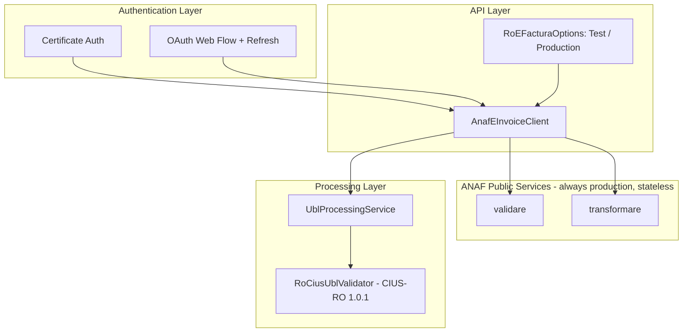

# RoEFactura - Romanian ANAF eInvoicing Integration

[](https://www.nuget.org/packages/RoEFactura)
[](https://dotnet.microsoft.com)
[](LICENSE)

RoEFactura is a .NET library for integrating with the Romanian ANAF eFactura system. It supports
certificate-based authentication for desktop/server scenarios and OAuth 2.0 redirect flow (including
refresh tokens) for web apps. It also provides local UBL 2.1 processing with CIUS-RO 1.0.1 validation.

## Features

- Dual authentication: certificate-based and OAuth redirect flow, with refresh-token support
- Full official ANAF e-Factura contract: `upload`/`uploadb2c`, `stareMesaj`, `listaMesajeFactura`
  (paged and non-paged), `descarcare`, public `validare` and `transformare` (XML→PDF)
- TEST environment by default; Production is an explicit opt-in
- Typed errors (`AnafApiException`, `AnafRateLimitException` with `RetryAfter`) and a `CancellationToken`
  on every ANAF call (required on the new overloads of members kept from 1.x, optional on brand-new
  members) — except the obsolete, disk-based `DownloadEInvoiceAsync` and the local (no-ANAF-call)
  `ValidateInvoiceXmlAsync`, neither of which takes one
- Local UBL 2.1 processing and CIUS-RO 1.0.1 validation (see [docs/VALIDATION_RULES.md](docs/VALIDATION_RULES.md))
- Invoice analysis extension methods
- Processing statistics (per service instance) and `ILogger` integration; no PII or XML content is logged

## Requirements

- .NET 10 (`net10.0`)
- Romanian digital certificate installed in CurrentUser/Personal (for certificate-based flow)

## Installation

### NuGet Package Manager
```bash
Install-Package RoEFactura
```

### .NET CLI
```bash
dotnet add package RoEFactura
```

### PackageReference
```xml
<PackageReference Include="RoEFactura" Version="2.0.0" />
```

## Quick Start

### Certificate-based (desktop/server)

```csharp
using Microsoft.Extensions.DependencyInjection;
using RoEFactura;
using RoEFactura.Models;
using RoEFactura.Services.Api;
using RoEFactura.Services.Authentication;

var services = new ServiceCollection();
services.AddRoEFactura(); // defaults to the ANAF TEST environment

var provider = services.BuildServiceProvider();
var auth = provider.GetRequiredService<IAnafOAuthClient>();
var invoices = provider.GetRequiredService<IAnafEInvoiceClient>();

var token = await auth.GetAccessTokenAsync(
    clientId: "your_client_id",
    clientSecret: "your_client_secret",
    callbackUrl: "https://yourapp.com/callback");

var items = await invoices.ListEInvoicesAsync(
    token.AccessToken, days: 30, cui: "RO12345678", filter: null, CancellationToken.None);
```

### OAuth redirect flow (web apps)

```csharp
// Program.cs
builder.Services.AddRoEFacturaWithOAuth(builder.Configuration, "AnafOAuth");
```

```json
// appsettings.json
{
  "AnafOAuth": {
    "ClientId": "your_client_id",
    "ClientSecret": "your_client_secret",
    "RedirectUri": "https://yourapp.com/api/oauth/callback"
  }
}
```

```csharp
// Controller example
[HttpPost("oauth/initiate")]
public IActionResult Initiate()
{
    var state = GenerateState();
    var authUrl = _anafOAuthClient.GenerateAuthorizationUrl(_options, state);
    return Ok(new { authorizationUrl = authUrl, state });
}

[HttpGet("oauth/callback")]
public async Task<IActionResult> Callback(string code, string state, CancellationToken ct)
{
    ValidateState(state);
    var token = await _anafOAuthClient.ExchangeAuthorizationCodeAsync(code, _options, ct);
    await StoreTokenAsync(token);
    return Redirect("/dashboard?authorized=true");
}
```

## Configuration

RoEFactura binds two independent configuration sections. Neither is required for the library to
resolve (`AddRoEFactura()` with no `IConfiguration` works out of the box against ANAF TEST).

### `RoEFactura` — ANAF environment

```json
// appsettings.json
{
  "RoEFactura": {
    "Environment": "Test",
    "ApiBaseUrl": null,
    "PublicServicesBaseUrl": "https://webservicesp.anaf.ro/prod/FCTEL/rest"
  }
}
```

```csharp
builder.Services.AddRoEFactura(builder.Configuration);
```

- **`RoEFactura:Environment`** — `Test` (default, `https://api.anaf.ro/test/FCTEL/rest`) or
  `Production` (`https://api.anaf.ro/prod/FCTEL/rest`, must be set explicitly to opt in). A missing
  section, a missing key, or an unset value all resolve to `Test`.
- **`ApiBaseUrl`** — when set, overrides `Environment` for the authenticated (Bearer) endpoints. Must
  be an absolute `http`/`https` URL, otherwise resolving `IAnafEInvoiceClient` from the container throws
  `InvalidOperationException` (the client's constructor resolves the base URL eagerly).
- **`PublicServicesBaseUrl`** — the base URL for `ValidateWithAnafAsync`/`ConvertToPdfAsync`. These are
  ANAF's public, **stateless** services: they always target production
  (`https://webservicesp.anaf.ro/prod/FCTEL/rest`) regardless of `Environment`, and they never touch SPV
  or require a Bearer token. Override only if ANAF changes this URL.

Programmatic configuration (no `IConfiguration` needed):

```csharp
services.AddRoEFactura(options =>
{
    options.Environment = AnafEnvironment.Production; // opt-in; defaults to Test
});
```

### `AnafOAuth` — OAuth client credentials

```json
// appsettings.json
{
  "AnafOAuth": {
    "ClientId": "your_client_id",
    "ClientSecret": "your_client_secret",
    "RedirectUri": "https://yourapp.com/api/oauth/callback",
    "AuthorizeUrl": "https://logincert.anaf.ro/anaf-oauth2/v1/authorize",
    "TokenUrl": "https://logincert.anaf.ro/anaf-oauth2/v1/token",
    "IncludeTokenContentType": true
  }
}
```

```csharp
builder.Services.AddRoEFacturaWithOAuth(builder.Configuration, "AnafOAuth");
```

Or directly:

```csharp
services.AddRoEFacturaWithOAuth(new AnafOAuthOptions
{
    ClientId = "your_client_id",
    ClientSecret = "your_client_secret",
    RedirectUri = "https://yourapp.com/oauth/callback"
});
```

`AddRoEFacturaWithOAuth` always registers the `RoEFactura` section too (via the same
`IConfiguration`); if that section is absent, the client still defaults to TEST.

## Operations

All ANAF-calling operations below take a `CancellationToken` (optional on the new members, required on
the `CancellationToken`-overloads of the members kept from 1.x). Two exceptions make no ANAF call and
take no `CancellationToken`: the local `ValidateInvoiceXmlAsync` and the obsolete, disk-based
`DownloadEInvoiceAsync` (use `DownloadMessageAsync` instead).

### Upload / uploadb2c

```csharp
var result = await invoices.UploadAsync(
    token.AccessToken,
    xml: xmlBytes,
    options: new AnafUploadOptions
    {
        Cif = "12345678",
        Standard = AnafDocumentStandard.Ubl, // UBL, CreditNote, Cii or Rasp
        IsB2C = false,      // true → posts to uploadb2c instead of upload
        ExternalBuyer = false, // extern=DA: buyer has no Romanian CUI/NIF
        SelfBilling = false,   // autofactura=DA: invoice issued by the beneficiary
        Enforcement = false,   // executare=DA: submitted by the enforcement body
    });

if (result.IsSuccess)
{
    string uploadIndex = result.UploadIndex!;
}
else
{
    foreach (var error in result.Errors) { /* handle */ }
}
```

### Status (`stareMesaj`)

```csharp
var status = await invoices.GetMessageStatusAsync(token.AccessToken, uploadIndex);
switch (status.State)
{
    case AnafMessageState.Ok:
        var downloadId = status.DownloadId!;
        break;
    case AnafMessageState.Nok:
        // status.Errors has the rejection reasons
        break;
    case AnafMessageState.InProcessing:
        // retry later
        break;
    case AnafMessageState.RejectedAtUpload:
        // "XML cu erori nepreluat de sistem" — the file never entered processing
        break;
}
```

### Download (`descarcare`)

```csharp
var download = await invoices.DownloadMessageAsync(token.AccessToken, downloadId);
byte[]? invoiceXml = download.DocumentXml;      // invoice or error XML, split from the signature
byte[]? signatureXml = download.SignatureXml;   // Ministry of Finance signature sidecar
```

`DownloadMessageAsync` splits the ANAF ZIP entirely in memory — no temporary files. To download and
get a parsed `InvoiceType` in one call, entirely in memory, use `ProcessDownloadedInvoiceAsync`:

```csharp
var result = await invoices.ProcessDownloadedInvoiceAsync(token.AccessToken, downloadId);
if (result.IsSuccess)
{
    var invoice = result.Data;
    var totalDue = invoice!.GetTotalAmountDue();
}
```

### Validate (local, RO_CIUS/CIUS-RO)

```csharp
var localResult = await invoices.ValidateInvoiceXmlAsync(xmlContent);
if (!localResult.IsSuccess)
{
    foreach (var error in localResult.Errors)
    {
        Console.WriteLine($"{error.ErrorCode}: {error.ErrorMessage}");
    }
}
```

### Validate with ANAF (public, stateless)

```csharp
var anafValidation = await invoices.ValidateWithAnafAsync(xmlBytes, AnafDocumentStandard.Ubl);
if (!anafValidation.IsValid)
{
    foreach (var message in anafValidation.Messages) { /* handle */ }
}
```

`ValidateWithAnafAsync` never sends an `Authorization` header and always targets ANAF's public
production `validare` service, regardless of the configured `Environment`.

### XML → PDF

```csharp
byte[] pdfBytes = await invoices.ConvertToPdfAsync(xmlBytes, AnafDocumentStandard.Ubl);

// Skip ANAF-side validation (result is not guaranteed correct for invalid XML):
byte[] unvalidatedPdf = await invoices.ConvertToPdfAsync(xmlBytes, AnafDocumentStandard.Ubl, validate: false);
```

### Refresh token

```csharp
if (string.IsNullOrEmpty(token.RefreshToken))
{
    // No refresh token available — re-authorize instead (see GenerateAuthorizationUrl above).
}
else
{
    var refreshed = await auth.RefreshAccessTokenAsync(token.RefreshToken, options, CancellationToken.None);
    // refreshed.AccessToken, refreshed.ExpiresAtUtc.
    // refreshed.RefreshToken may be empty — if so, keep using token.RefreshToken for the next refresh.
}
```

## Error handling

| Exception | When | Notes |
| --- | --- | --- |
| `AnafApiException` (`: HttpRequestException`) | ANAF returned a non-2xx response | `RawResponse`, `Errors`, `IsUnauthorized` (401/403) |
| `AnafRateLimitException` (`: AnafApiException`) | ANAF returned HTTP 429 | `RetryAfter` (from the `Retry-After` header, when present); the library does not retry automatically |
| `AnafDownloadWindowExpiredException` | The 60-day `descarcare` window has passed | `AnafDownloadId`, `AnafErrorMessage` |
| `TokenExchangeException` with `ErrorType == TokenExchangeErrorType.InvalidGrant` | The authorization code or refresh token is invalid, expired or revoked | Re-run the OAuth authorization flow from the start |

Existing `catch (HttpRequestException)` handlers keep working unchanged, because `AnafApiException`
and `AnafRateLimitException` are both subclasses of `HttpRequestException`. To distinguish ANAF's
typed errors from a plain transport failure (DNS, connection refused), catch `AnafApiException` first:

```csharp
try
{
    await invoices.UploadAsync(token.AccessToken, xmlBytes, options);
}
catch (AnafRateLimitException ex)
{
    // wait ex.RetryAfter before retrying
}
catch (AnafApiException ex) when (ex.IsUnauthorized)
{
    // token expired or lacks SPV rights — refresh or re-authenticate
}
catch (AnafApiException ex)
{
    // ex.RawResponse, ex.Errors
}
catch (HttpRequestException)
{
    // DNS/connection failure, not an ANAF-level error
}
```

## Official ANAF limits

Source: ANAF's published e-Factura API call limits ("Limite la apelarea API eFactura"); consult the
official ANAF SPV/eFactura documentation for the current values, as ANAF may change them.

| Operation | Limit |
| --- | --- |
| All calls | **1,000 calls/minute** |
| `/upload` (invoice files) | No limit |
| `/upload` (RASP response files) | 1,000/day/CUI |
| `/stare` (`stareMesaj`) | 100 queries/day per message; no total daily limit per CUI |
| `/lista` (non-paged) | 1,500 queries/day/CUI |
| `/lista` (paged) | 100,000 queries/day/CUI |
| `/descarcare` | 10 downloads/day per message; no total daily limit per CUI |
| Upload body size (`UploadAsync`) | 10 MB, enforced client-side before any HTTP call |
| Validate/PDF body size (`ValidateWithAnafAsync`/`ConvertToPdfAsync`) | 5 MB, enforced client-side before any HTTP call |

Repeatedly ignoring rate-limit errors can lead ANAF to block API access for the offending user or
application. This library does not retry automatically; use `AnafRateLimitException.RetryAfter` to
implement your own backoff.

## Common Workflows

### 1) List and download all invoices for a period

```csharp
var list = await invoices.ListEInvoicesAsync(token.AccessToken, 30, "RO12345678", filter: null, ct);
foreach (var item in list)
{
    var processed = await invoices.ProcessDownloadedInvoiceAsync(token.AccessToken, item.Id, ct);
    if (processed.IsSuccess)
    {
        Console.WriteLine(processed.Data?.ID?.Value);
    }
}
```

### 2) Upload a new invoice with validation

```csharp
var local = await invoices.ValidateInvoiceXmlAsync(xmlContent);
if (!local.IsSuccess)
{
    return; // handle local RO_CIUS/CIUS-RO errors
}

var anafValidation = await invoices.ValidateWithAnafAsync(xmlBytes, AnafDocumentStandard.Ubl, ct);
if (!anafValidation.IsValid)
{
    return; // handle ANAF-side errors
}

var uploadResult = await invoices.UploadAsync(
    token.AccessToken, xmlBytes, new AnafUploadOptions { Cif = "12345678" }, ct);
```

### 3) Refresh an expiring token

```csharp
if (token.ExpiresAtUtc <= DateTimeOffset.UtcNow.AddMinutes(5))
{
    if (string.IsNullOrEmpty(token.RefreshToken))
    {
        // No refresh token on file — re-authorize instead of calling RefreshAccessTokenAsync.
        return RedirectToAuthorize();
    }
    token = await auth.RefreshAccessTokenAsync(token.RefreshToken, options, ct);
}
```

### 4) Extract data from a processed invoice

```csharp
var result = await invoices.ProcessDownloadedInvoiceAsync(token.AccessToken, "download_id", ct);
if (result.IsSuccess && result.Data != null)
{
    var invoice = result.Data;
    var sellerVat = invoice.GetSellerVatId();
    var totalWithVat = invoice.GetTotalWithVat();
    var summary = invoice.GetValidationSummary();
}
```

Notes:
- `filter` is passed as ANAF query parameter `filtru`. Accepted values are defined by ANAF (see
  [docs/API_REFERENCE.md](docs/API_REFERENCE.md)).
- Local validation (`ValidateInvoiceXmlAsync`) uses CIUS-RO 1.0.1 rules and does not call ANAF; it is a
  fast pre-check, not a replacement for `ValidateWithAnafAsync`.

## Extension Methods Quick Reference

| Method | Returns | Description |
| --- | --- | --- |
| `IsRomanianInvoice()` | bool | Detects Romanian invoices (CIUS-RO, legacy RO_CIUS, or RO parties) |
| `GetCurrencyCode()` | string | Document currency code |
| `GetTotalAmountDue()` | decimal | Payable amount |
| `GetTotalWithoutVat()` | decimal | Tax exclusive amount |
| `GetTotalWithVat()` | decimal | Tax inclusive amount |
| `GetTotalVat()` | decimal | Total VAT amount |
| `GetSumOfLineNet()` | decimal | Sum of line net amounts |
| `GetValidationSummary()` | string | Human-readable validation summary |
| `GetSellerVatId()` | string? | Seller VAT identifier |
| `GetBuyerVatId()` | string? | Buyer VAT identifier |
| `GetSellerLegalId()` | string? | Seller legal registration id |
| `GetBuyerLegalId()` | string? | Buyer legal registration id |
| `LoadInvoiceFromXml()` | InvoiceType? | Parse UBL XML to object |
| `SaveInvoiceToXml()` | string | Serialize UBL invoice to XML (UTF-8 declaration) |
| `SaveInvoiceToXmlBytes()` | byte[] | Serialize UBL invoice to UTF-8 bytes without a BOM |

## Romanian Constants Reference

| Constant | Values |
| --- | --- |
| `RomanianConstants.CustomizationId` | `urn:cen.eu:en16931:2017#compliant#urn:efactura.mfinante.ro:CIUS-RO:1.0.1` |
| `RomanianConstants.RoCiusCustomizationId` (obsolete) | `urn:cen.eu:en16931:2017#compliant#urn:efactura.mfinante.ro:RO_CIUS:1.0.0.2021` — legacy identifier, detection only |
| `ValidInvoiceTypeCodes` | `380`, `389`, `384`, `381`, `751` |
| `ValidVatPointDateCodes` | `3`, `35`, `432` |
| `ValidCountyCodes` | `RO-AB, RO-AR, RO-AG, RO-B, RO-BC, RO-BH, RO-BN, RO-BT, RO-BV, RO-BR, RO-BZ, RO-CS, RO-CL, RO-CJ, RO-CT, RO-CV, RO-DB, RO-DJ, RO-GL, RO-GR, RO-GJ, RO-HR, RO-HD, RO-IL, RO-IS, RO-IF, RO-MM, RO-MH, RO-MS, RO-NT, RO-OT, RO-PH, RO-SM, RO-SJ, RO-SB, RO-SV, RO-TR, RO-TM, RO-TL, RO-VS, RO-VL, RO-VN` |
| `BucharestSectorCodes` | `SECTOR1, SECTOR2, SECTOR3, SECTOR4, SECTOR5, SECTOR6` |

See [docs/VALIDATION_RULES.md](docs/VALIDATION_RULES.md) for the full rule table.

## Architecture Overview



## Migrating from 1.x

1. **Set the environment explicitly if you rely on production behaviour.** 1.x always called ANAF
   production. 2.0 defaults to ANAF TEST. Add `"RoEFactura": { "Environment": "Production" }` to your
   configuration (or `services.AddRoEFactura(o => o.Environment = AnafEnvironment.Production)`) before
   deploying, and pass `builder.Configuration` into `AddRoEFactura`/`AddRoEFacturaWithOAuth` so the
   section is actually bound.
2. **Replace the removed upload/validate members.**
   - `UploadXmlAsync`/`UploadXmlContentAsync` → `UploadAsync(token, xmlBytes, new AnafUploadOptions { Cif = "..." }, ct)`.
   - `ValidateXmlAsync`/`ValidateXmlContentAsync` → `ValidateWithAnafAsync(xmlBytes, AnafDocumentStandard.Ubl, ct)`.
3. **`DownloadEInvoiceAsync` still works** but is `[Obsolete]`. Migrate to `DownloadMessageAsync`
   (in-memory) or `ProcessDownloadedInvoiceAsync` (in-memory, parsed) when convenient.
4. **Catch `AnafApiException`/`AnafRateLimitException` where you want ANAF-specific details.** A plain
   `catch (HttpRequestException)` still compiles and still catches these (they subclass it), so no code
   changes are required to keep existing behaviour.
5. **Remove any `Newtonsoft.Json`-specific assumptions** (e.g. custom `JsonConverter`s registered against
   this library's DTOs). All (de)serialization is now `System.Text.Json`.
6. **`RomanianConstants.ValidCountyCodes` values now carry the `RO-` prefix** (`RO-CJ`, not `CJ`). If you
   read this constant directly, update comparisons accordingly.
7. **If you multi-targeted `net9.0`, move to `net10.0`.** The package now targets `net10.0` only.

## Additional Documentation

- API reference: [docs/API_REFERENCE.md](docs/API_REFERENCE.md)
- Validation rules: [docs/VALIDATION_RULES.md](docs/VALIDATION_RULES.md)
- Troubleshooting: [docs/TROUBLESHOOTING.md](docs/TROUBLESHOOTING.md)
- Examples: [docs/EXAMPLES.md](docs/EXAMPLES.md)
- Changelog: [CHANGELOG.md](CHANGELOG.md)

## Notes

- The default ANAF environment is **TEST**; set `RoEFactura:Environment=Production` to opt in.
- `ValidateWithAnafAsync`/`ConvertToPdfAsync` always target ANAF's public production services, are
  stateless, and never send an Authorization header, regardless of the configured environment.
- Local validation (`ValidateInvoiceXmlAsync`) uses CIUS-RO 1.0.1 rules and does not call ANAF.

## Contributing

Contributions are welcome. Please open an issue with details and a minimal reproduction. Pull requests should include documentation updates where relevant.

## License

MIT License. See [LICENSE](LICENSE).

## Quick Reference

```bash
dotnet add package RoEFactura
```

```csharp
services.AddRoEFactura(); // ANAF TEST by default
var token = await anafOAuthClient.GetAccessTokenAsync(clientId, clientSecret, callbackUrl);
var invoices = await anafEInvoiceClient.ListEInvoicesAsync(token.AccessToken, 30, "RO12345678", filter: null, CancellationToken.None);
```
